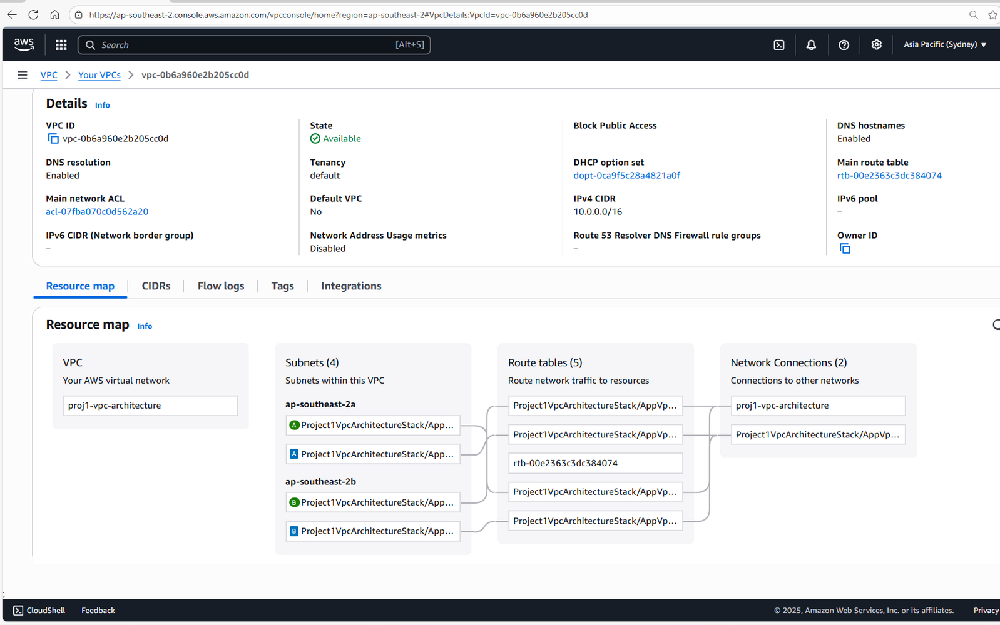

# Project 1 – Secure VPC Network Architecture

**Summary**  
Designed a secure AWS VPC with subnet segmentation, NAT Gateway, and Bastion Host using Infrastructure as Code (AWS CDK, TypeScript).  

👉 [Read the full Architecture Decision Record (ADR)](./adr.md)  
👉 [View Screenshots](./cdk/screenshots/)  

---

## 1. Overview
This project demonstrates how to design and implement a **secure Virtual Private Cloud (VPC)** on AWS.  
It includes public and private subnet segmentation, a NAT Gateway for controlled outbound traffic, and a Bastion Host for secure administrative access.  

## 2. Business Need
Organisations require secure and scalable network architectures to host workloads in the cloud.  
This design supports:  
- Isolated private subnets for application and database layers  
- Secure outbound internet access without exposing private resources  
- Controlled, auditable administrative access via a Bastion Host  

## 3. Architecture Diagram

## 4. AWS Services Used
- **Amazon VPC** – isolated network environment  
- **Subnets** – segmentation of resources into public/private zones  
- **Internet Gateway (IGW)** – internet access for public subnets  
- **NAT Gateway** – controlled outbound traffic from private subnets  
- **EC2 Bastion Host** – secure SSH entry point to private subnets  
- **Route Tables** – define network paths  
- **Security Groups** – enforce least privilege access  

## 5. Step-by-Step Implementation
- **Day 1** – AWS setup: IAM, CLI, GitHub repo, CDK bootstrap  
- **Day 2** – Initialise CDK app, deploy minimal VPC with public/private isolated subnets  
- **Day 3** – Expand subnets and routing across 2 AZs  
- **Day 4** – Add NAT Gateway and Bastion Host for secure access  
- Verified deployments in AWS Console (VPC, subnets, routes, EC2 connectivity)  

## 6. Improvements Added
- Applied least privilege IAM roles  
- Configured Security Groups for Bastion Host (SSH only from my IP)  
- Segregated resources across multiple AZs for high availability  

## 7. Possible Enhancements
- Replace Bastion Host with **AWS Systems Manager Session Manager** (removes need for public SSH)  
- Add **VPC Flow Logs** for network monitoring  
- Implement **multi-AZ NAT Gateways** for higher resilience  

## 8. Failure Scenarios & Mitigations
- **NAT Gateway failure** → private subnets lose outbound internet  
  - *Mitigation:* deploy NAT in multiple AZs  
- **Bastion Host compromise** → attacker could pivot into private subnets  
  - *Mitigation:* restrict Security Group to specific IPs, consider Session Manager  

## 9. Expected Outcomes
- Secure, production-style network design  
- Applications in private subnets remain protected while retaining necessary outbound access  
- Administrative access tightly controlled via Bastion Host  

## 10. Clean-up Steps
- Run `cdk destroy` to remove stacks  
- Manually delete S3 buckets created for assets (if not empty)  
- Confirm NAT Gateway removed (avoid ongoing cost)  

## 11. Challenges & Solutions
- **Initial bootstrap errors** due to missing IAM permissions → fixed by attaching AdministratorAccess to IAM user temporarily  
- **S3 bucket naming conflicts** → solved by using globally unique names with suffixes  

## 12. Reflection / Lessons Learned
- Building in increments helped me understand how VPC components fit together  
- Using Infrastructure as Code (CDK) makes deployments consistent and repeatable  
- Documenting each step makes future projects faster and more professional  

---

## Supporting Materials
- [Architecture Decision Record (ADR)](./adr.md)  
- [Screenshots](./cdk/screenshots/)
