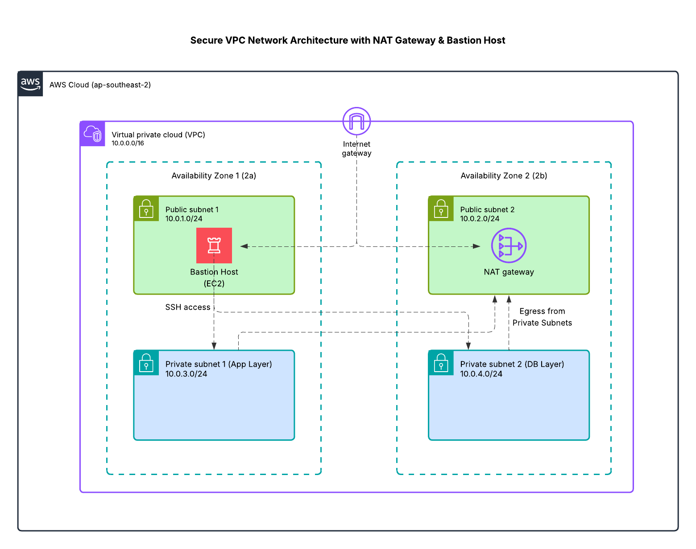

# Secure VPC Network Architecture



**Summary**  
A secure, production-style AWS VPC using public and private subnets, a cost-aware NAT Gateway, and a Bastion Host for controlled administrative access — deployed using Infrastructure as Code (**AWS CDK**, TypeScript).

👉 [Read the Architecture Decision Record (ADR)](./adr.md)  
👉 [View Screenshots](./cdk/screenshots/)

---

# 1. Overview
This project demonstrates how to design and deploy a **secure, scalable Virtual Private Cloud (VPC)** on AWS.  
It forms the foundation for hosting cloud workloads by implementing subnet segmentation, controlled network access, and a secure administrative entry point.

Core capabilities:

- Public and private subnet separation  
- Secure outbound internet access for private workloads  
- Controlled SSH access via a Bastion Host  
- Entire architecture codified using **AWS CDK (TypeScript)**  

---

# 2. Business Need
Modern organisations require secure, structured cloud networks to run applications reliably.  
This architecture solves key business requirements:

- Protect sensitive workloads in private subnets  
- Prevent direct exposure of internal systems to the internet  
- Provide auditable, least-privilege administrative access  
- Maintain low operational cost while preserving a production-grade layout  

This VPC acts as a **baseline cloud foundation** for further application, database, or containerised workload deployments.

---

# 3. Architecture Diagram


---

# 4. AWS Services Used
- **Amazon VPC** — isolated, secure network boundary  
- **Public & Private Subnets** — structured workload segmentation  
- **Internet Gateway (IGW)** — internet access for public subnets  
- **NAT Gateway** — secure outbound access for private subnets  
- **EC2 Bastion Host** — controlled administrative entry point  
- **Route Tables** — explicit routing for each subnet tier  
- **Security Groups** — least-privilege network access control  

---

# 5. Step-by-Step Implementation
- **Day 1** — AWS setup: IAM, CLI, CDK bootstrap, GitHub repository  
- **Day 2** — Created CDK app and foundational VPC structure  
- **Day 3** — Implemented multi-AZ public/private subnet design  
- **Day 4** — Added NAT Gateway and Bastion Host with controlled SSH access  
- Verified subnets, routing, NAT behaviour, and SSH access patterns  

---

# 6. Improvements Added
- Least-privilege Security Group for the Bastion Host  
- SSH restricted to a deploy-time trusted **/32 CIDR**  
- Resources distributed across **multiple AZs**  
- Tags applied for clarity in AWS Console views  

---

# 7. Possible Enhancements
Future improvements that align with production architectures:

- Replace Bastion Host with **AWS Systems Manager Session Manager**  
  → removes need for SSH and avoids exposing a public EC2 instance  
- Enable **VPC Flow Logs** for enhanced network visibility  
- Add multi-AZ NAT Gateways for increased resilience  

---

# 8. Failure Scenarios & Mitigations

### NAT Gateway failure  
Private subnets lose outbound internet access.  
**Mitigation:** Deploy multiple NAT Gateways (one per AZ).

### Bastion Host compromise  
Threat of lateral movement inside VPC.  
**Mitigation:**  
- Restrict SSH to a trusted /32 CIDR  
- Move toward Session Manager (SSH-less access)  
- Ensure MFA and strict IAM governance for key pairs  

---

# 9. Expected Outcomes
- A secure, isolated VPC ready for real application deployments  
- Private subnets remain protected from the public internet  
- Administrative access is controlled and auditable  
- Fully repeatable VPC deployments through Infrastructure as Code  

---

# 10. Clean-up Steps
⚠️ NAT Gateways incur ongoing hourly cost.

To safely remove the environment:

```bash
cdk destroy
```

Then:

- Manually delete non-empty CDK asset buckets (if created)  
- Confirm NAT Gateway removal to avoid charges  

---

# 11. Challenges & Solutions
- **Bootstrap / IAM permissions issues**  
  → temporarily elevated IAM permissions to complete bootstrap  
- **S3 asset naming conflicts**  
  → solved by adding unique suffixes to bucket names  

---

# 12. Reflection / Lessons Learned
- Building the VPC in increments clarified how AWS networking components interact  
- Using the CDK avoided configuration drift and made redeployment effortless  
- This project forms the core cloud networking foundation used across all modern AWS architectures  

---

# Supporting Materials
- [Architecture Decision Record (ADR)](./adr.md)  
- [Screenshots](./cdk/screenshots/)
